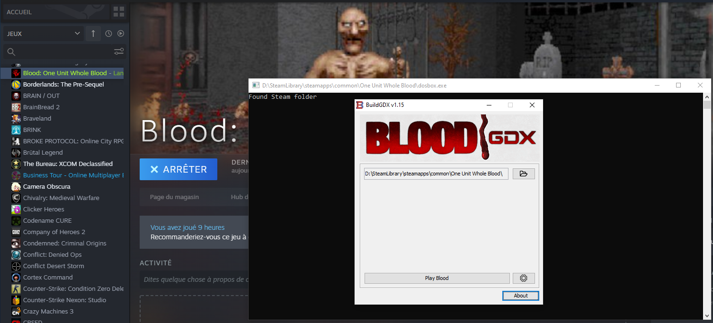

# BloodGDX Steam Launcher

Just a simple C program to run bloodgdx when launching the game through Steam

## How to use? (and build)

Just run `build.bat` (it will build the exe file). \
Then, download BuildGDX jar, and put it in your Steam
Blood directory. It must be named `BuildGDX.jar`. \
Rename the original `dosbox.exe` file to whatever 
you want, for example, `dosbox.exe.orig`. \
Copy the compiled `dosbox.exe` to your Blood Steam folder.

You can now run the game using the Steam Play button.

Antoine "AntoineJT" Tournepiche
